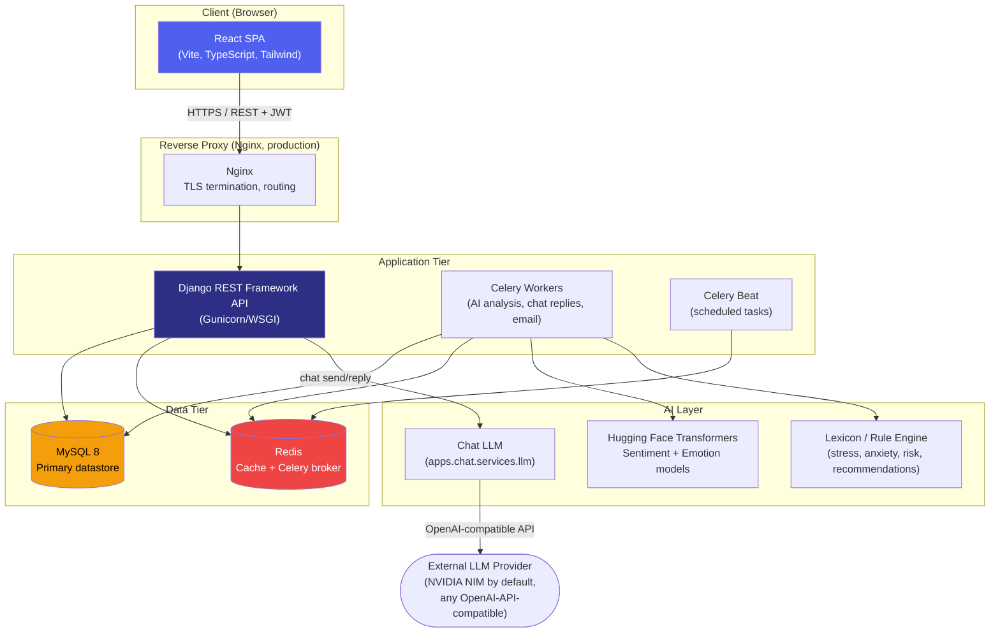

# System Architecture

## Component overview

## Layer responsibilities

| Layer | Technology | Responsibility |
|---|---|---|
| Client | React 18 + TypeScript + Tailwind | SPA UI, JWT storage, chart rendering, dark/light mode |
| Reverse proxy | Nginx | TLS termination, routes `/api/*` to Django, `/` to the frontend static build |
| Application | Django REST Framework | Business logic, JWT auth, permissions, serialization |
| AI layer | Hugging Face Transformers + rule-based services + chat LLM client | Sentiment/emotion classification, lexicon-based construct scoring, crisis-phrase detection, wellness score computation, trend prediction, AI companion replies |
| Async | Celery + Redis | AI analysis dispatch, email delivery, scheduled reminders and daily sweeps |
| Chat | `apps.chat` (Django) + external LLM provider | Conversation storage/history/search/export live in MySQL like everything else; message generation is one API call out to the configured provider — see [AI Chat Integration](ai-chat-integration.md) |
| Data | MySQL 8 | System of record for all domain data (30+ normalized tables — see [docs/database/schema.md](../database/schema.md)) |
| Cache/Queue | Redis | DRF throttle counters, Celery broker/result backend |

## Why these boundaries

- **AI inference is isolated in Celery workers**, not the request/response cycle — sentiment/emotion analysis and model loading are too slow to run synchronously in an API view. `AI_ANALYSIS_ENABLED=False` lets the API run entirely without the AI dependency stack installed (see `apps.ai_engine.services.model_loader`). Chat replies are the one exception — the LLM call happens synchronously inside the `send` request, since the user is waiting for a response; if the provider is unreachable, the user's message is still saved and the request still returns 201 rather than failing.
- **MySQL is the single source of truth for everything**, including chat — there's no external chat datastore to keep in sync. Only the reply generation itself is delegated externally.
