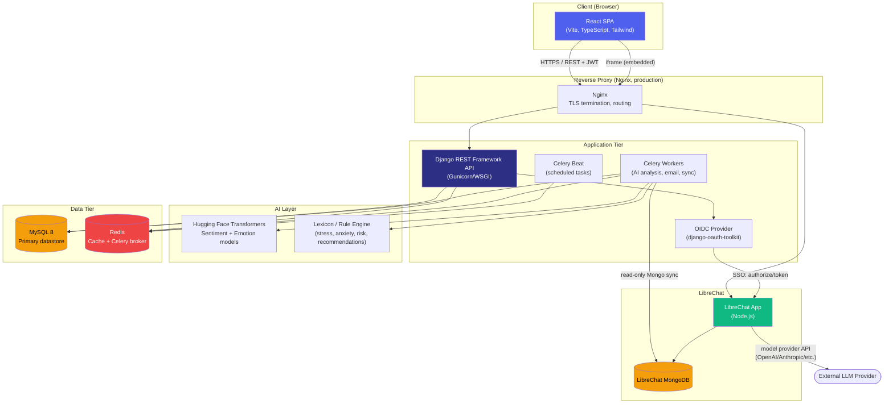

# System Architecture

## Component overview

## Layer responsibilities

| Layer | Technology | Responsibility |
|---|---|---|
| Client | React 18 + TypeScript + Tailwind | SPA UI, JWT storage, chart rendering, dark/light mode |
| Reverse proxy | Nginx | TLS termination, routes `/api/*` and `/o/*` to Django, `/` to the frontend static build, `/ai-chat/*` to LibreChat (production same-domain setup — see [librechat-integration.md](librechat-integration.md)) |
| Application | Django REST Framework | Business logic, auth (JWT + OIDC), permissions, serialization |
| AI layer | Hugging Face Transformers + rule-based services | Sentiment/emotion classification, lexicon-based construct scoring, crisis-phrase detection, wellness score computation, trend prediction |
| Async | Celery + Redis | AI analysis dispatch, email delivery, LibreChat conversation sync, scheduled reminders and daily sweeps |
| Chat | LibreChat (Node.js) + its own MongoDB | Conversational AI UI and LLM orchestration; MindCare mirrors its data one-directionally (read-only) |
| Data | MySQL 8 | System of record for all MindCare domain data (30+ normalized tables — see [docs/database/schema.md](../database/schema.md)) |
| Cache/Queue | Redis | DRF throttle counters, Celery broker/result backend |

## Why these boundaries

- **LibreChat is not forked or modified.** MindCare treats it as an external system integrated via two narrow, well-defined interfaces: OIDC (for auth) and a read-only MongoDB sync (for conversation history). This keeps LibreChat upgradable independently of MindCare's codebase.
- **AI inference is isolated in Celery workers**, not the request/response cycle — sentiment/emotion analysis and model loading are too slow to run synchronously in an API view. `AI_ANALYSIS_ENABLED=False` lets the API run entirely without the AI dependency stack installed (see `apps.ai_engine.services.model_loader`).
- **MySQL is the single source of truth** for everything except live chat content, which is why chat messages are *mirrored* into MySQL (for search/export/analysis) rather than MindCare depending on LibreChat's Mongo store at request time.
