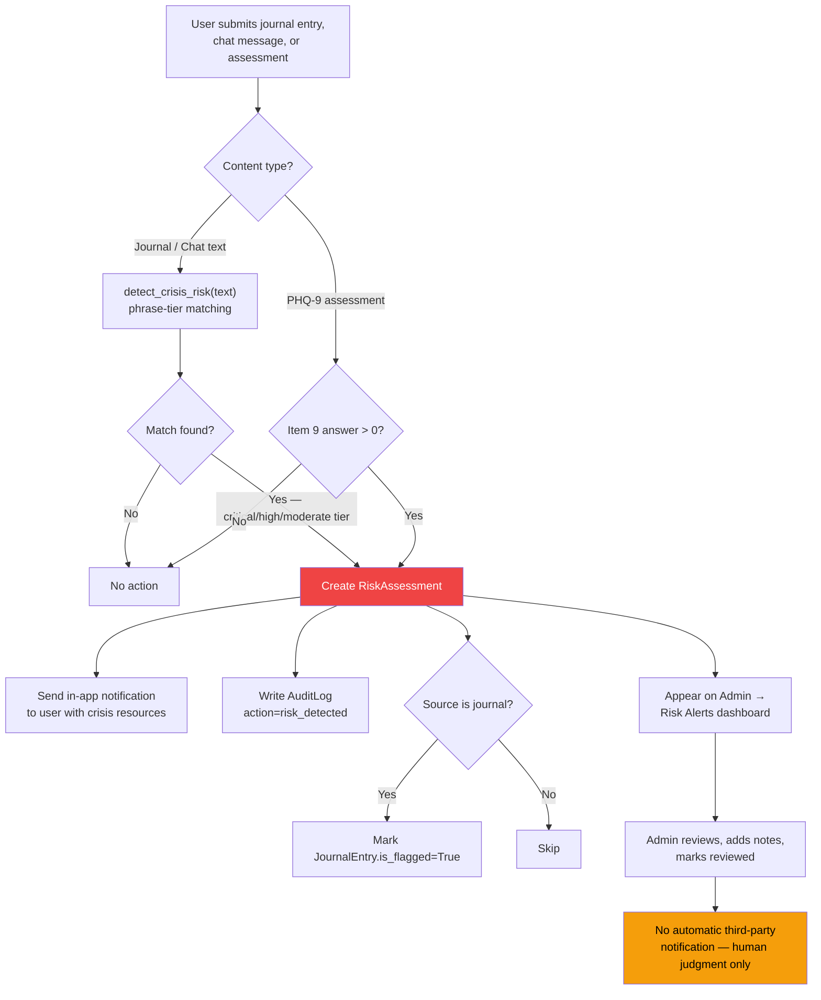
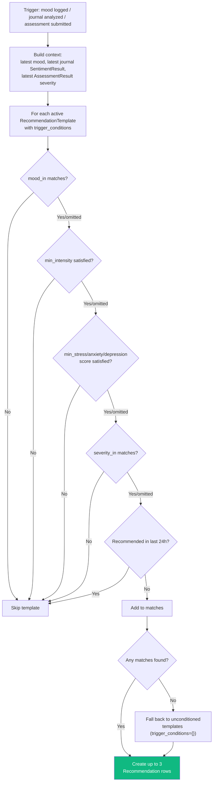
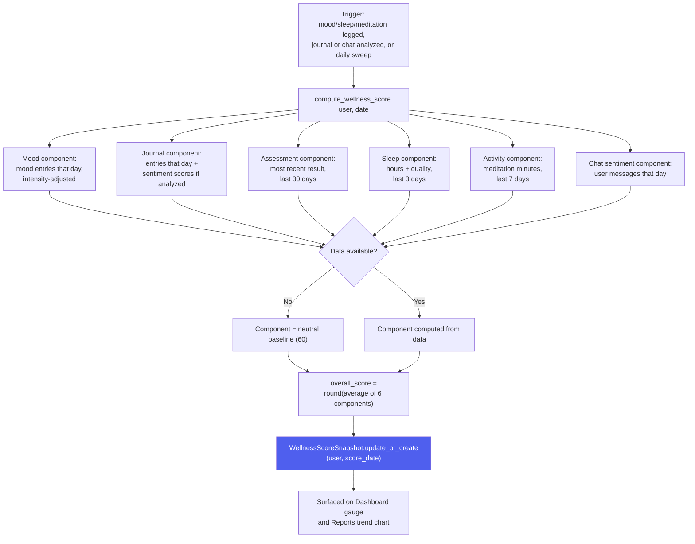

# Flowcharts

## 1. Emergency / crisis detection decision flow

```mermaid
flowchart TD
    A["User submits journal entry,\nchat message, or assessment"] --> B{Content type?}
    B -->|Journal / Chat text| C["detect_crisis_risk(text)\nphrase-tier matching"]
    B -->|PHQ-9 assessment| D{"Item 9 answer > 0?"}

    C --> E{Match found?}
    E -->|No| F[No action]
    E -->|"Yes — critical/high/moderate tier"| G[Create RiskAssessment]

    D -->|No| F
    D -->|Yes| G

    G --> H[Send in-app notification\nto user with crisis resources]
    G --> I[Write AuditLog\naction=risk_detected]
    G --> J{Source is journal?}
    J -->|Yes| K["Mark JournalEntry.is_flagged=True"]
    J -->|No| L[Skip]

    G --> M["Appear on Admin →\nRisk Alerts dashboard"]
    M --> N["Admin reviews, adds notes,\nmarks reviewed"]
    N --> O["No automatic third-party\nnotification — human judgment only"]

    style G fill:#ef4444,color:#fff
    style O fill:#f59e0b,color:#000
```

## 2. Recommendation engine decision flow

```mermaid
flowchart TD
    A[Trigger: mood logged / journal analyzed / assessment submitted] --> B["Build context:\nlatest mood, latest journal SentimentResult,\nlatest AssessmentResult severity"]
    B --> C["For each active RecommendationTemplate\nwith trigger_conditions"]
    C --> D{"mood_in matches?"}
    D -->|No| SKIP[Skip template]
    D -->|Yes/omitted| E{"min_intensity satisfied?"}
    E -->|No| SKIP
    E -->|Yes/omitted| F{"min_stress/anxiety/depression\nscore satisfied?"}
    F -->|No| SKIP
    F -->|Yes/omitted| G{"severity_in matches?"}
    G -->|No| SKIP
    G -->|Yes/omitted| H{"Recommended in last 24h?"}
    H -->|Yes| SKIP
    H -->|No| I[Add to matches]

    I --> J{"Any matches found?"}
    J -->|Yes| K["Create up to 3\nRecommendation rows"]
    J -->|No| L["Fall back to unconditioned\ntemplates (trigger_conditions={})"]
    L --> K

    style K fill:#10b981,color:#fff
```

## 3. Wellness score computation flow

```mermaid
flowchart TD
    A["Trigger: mood/sleep/meditation logged,\njournal or chat analyzed, or daily sweep"] --> B[compute_wellness_score user, date]

    B --> C1["Mood component:\nmood entries that day,\nintensity-adjusted"]
    B --> C2["Journal component:\nentries that day +\nsentiment scores if analyzed"]
    B --> C3["Assessment component:\nmost recent result,\nlast 30 days"]
    B --> C4["Sleep component:\nhours + quality,\nlast 3 days"]
    B --> C5["Activity component:\nmeditation minutes,\nlast 7 days"]
    B --> C6["Chat sentiment component:\nuser messages that day"]

    C1 --> N{Data available?}
    C2 --> N
    C3 --> N
    C4 --> N
    C5 --> N
    C6 --> N
    N -->|No| BASE["Component = neutral baseline (60)"]
    N -->|Yes| CALC[Component computed from data]

    BASE --> AVG["overall_score =\nround(average of 6 components)"]
    CALC --> AVG
    AVG --> SAVE["WellnessScoreSnapshot.update_or_create\n(user, score_date)"]
    SAVE --> DASH["Surfaced on Dashboard gauge\nand Reports trend chart"]

    style SAVE fill:#4f5fee,color:#fff
```
