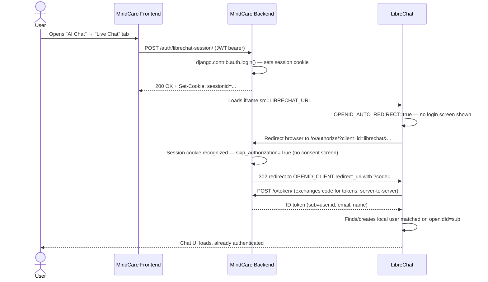

# LibreChat Integration

MindCare AI embeds [LibreChat](https://github.com/danny-avila/LibreChat) as
its AI Therapy chat interface rather than building a chat UI + LLM
orchestration layer from scratch. This document explains how the two
systems are wired together: single sign-on, conversation history sync, and
the practical constraints that shaped the design.

## Why LibreChat is untouched

LibreChat is run as-is via its official Docker image — MindCare doesn't
fork or patch it. Integration happens entirely through two interfaces
LibreChat already supports:

1. **OpenID Connect**, for authentication.
2. **Its own MongoDB**, read (never written) for conversation sync.

This means LibreChat can be upgraded independently, and any of its native
features (multiple model providers, plugins, etc.) work without MindCare
needing to know about them.

## 1. Single sign-on (MindCare as the OIDC provider)

A user who registers and logs into MindCare should not have to create a
*second* account or log in again for the chat feature. MindCare's backend
runs an OpenID Connect provider (`django-oauth-toolkit`, see
`apps.users.oidc`) that LibreChat is configured to trust as its identity
source.

**The flow:**



**Why a session-cookie bridge is needed at all:** every other endpoint in
this API is JWT bearer-token auth, which works over `fetch`/`axios` but
*not* over a full-page browser redirect (which is what OIDC's
authorization-code flow requires) — a redirected GET request can't carry a
custom `Authorization` header. `EstablishOIDCSessionView`
(`apps.users.views`) bridges the two: the SPA calls it once (authenticated
via JWT) immediately before loading the LibreChat iframe, and it
establishes a normal Django session cookie that *is* sent automatically on
the subsequent browser-driven redirect to `/o/authorize/`.

**Registration is one-time, done by an operator, not per-user:**

```bash
python manage.py generate_oidc_rsa_key   # once per environment; save the output to .env
python manage.py setup_librechat_oidc_client   # registers/updates the LibreChat OAuth2 client
```

See `.env.example` for the full set of `LIBRECHAT_OIDC_*` / `OIDC_*`
variables, and `librechat/config/librechat.env.example` for the matching
LibreChat-side configuration (`OPENID_CLIENT_ID`, `OPENID_ISSUER`, etc. —
values on both sides must match exactly).

### Known limitation: third-party cookies

Because the LibreChat UI is embedded in an `<iframe>`, the session cookie
`EstablishOIDCSessionView` sets is being read by a *nested* browsing
context — which some browsers (Safari ITP, Chrome's third-party cookie
phase-out, Firefox ETP) restrict more aggressively than a normal top-level
cross-site cookie. Mitigations, in order of preference:

1. **Serve LibreChat on a subdomain of the same parent domain as the
   frontend** (e.g. `chat.mindcare.example.com` vs. `app.mindcare.example.com`)
   — see `docker/nginx`. Subdomains of one registrable domain are still
   the same *site* for SameSite cookie purposes, so a
   `Domain=mindcare.example.com`-scoped cookie is sent on requests to
   either subdomain, sidestepping the third-party restriction entirely.
   Preferred over subpath-routing LibreChat (`/ai-chat/`), since that would
   require LibreChat to support being served under a URL subpath, which
   isn't guaranteed without explicit base-path build support. This is the
   recommended production setup.
2. **`SESSION_COOKIE_SAMESITE = "None"` + `Secure`**, set automatically in
   `config/settings/production.py` (requires HTTPS, which production
   already mandates). This keeps the cookie usable cross-site even without
   the reverse-proxy setup.
3. In local development (different `localhost` ports, no HTTPS), most
   browsers still allow the flow since `localhost` is commonly treated
   leniently, but this isn't guaranteed across all browsers/versions — if
   the auto-redirect silently fails to authenticate, use the "History" tab
   (native chat, always works) or test the OIDC flow directly without the
   iframe.

### Known limitation: LibreChat's OIDC client requires HTTPS

LibreChat's `openid-client` library hard-refuses to fetch discovery/tokens
from a non-HTTPS issuer (`[openidStrategy] only requests to HTTPS are
allowed`) — this isn't configurable via an env var, and the maintainers
have deliberately declined to add a bypass flag, since it'd be a real
attack vector. This bites local development, where `OPENID_ISSUER` would
otherwise point at the backend over plain HTTP inside the Compose network.

The dev stack works around this with `oidc-proxy` (`docker-compose.yml` /
`docker/oidc-proxy/`) — a tiny nginx container that terminates TLS with a
build-time-generated self-signed cert and forwards to `backend:8000`. It's
named with a hyphen, not an underscore: Django's Host-header validation
rejects underscores as invalid per RFC 1034/1035 even with
`ALLOWED_HOSTS=["*"]`, and this hostname is what LibreChat sends as `Host`.
`librechat`'s `NODE_EXTRA_CA_CERTS` is pointed at that cert (shared via the
`oidc_proxy_certs` volume) so its OIDC client trusts it. `OPENID_ISSUER` in
`librechat.env` and `OIDC_ISS_ENDPOINT` in `.env` both point at
`https://oidc-proxy/o` — the latter hardcodes the issuer django-oauth-toolkit
reports (see `OAUTH2_PROVIDER["OIDC_ISS_ENDPOINT"]` in `config/settings/base.py`)
so it matches exactly what LibreChat expects, independent of what
scheme/host the backend process itself sees the request over.

**This same issuer host also has to be reachable from the user's actual
browser, not just from containers.** django-oauth-toolkit derives *every*
OIDC endpoint from one `OIDC_ISS_ENDPOINT` host+port — including
`authorization_endpoint`, which is where the browser (not LibreChat's
server) gets redirected for the interactive login step. `oidc-proxy` only
resolves via Docker's embedded DNS, so without help the browser sees
"server not found." Fixed by publishing the proxy on host port 443
(`ports: ["443:443"]` on the `oidc-proxy` service — deliberately the
*default* HTTPS port, not a custom one like 8443: containers reach the
proxy on its real container-internal port via Docker DNS, the browser
reaches it via the host-published port, and since the issuer is one
string those two numbers must match, which they only do automatically
without a port suffix) and adding `127.0.0.1  oidc-proxy` to the host
machine's hosts file (see [installation-guide.md](installation-guide.md))
so the same hostname resolves for both containers (Docker DNS) and the
browser (hosts file). Requires port 443 to be free on the host.

Production doesn't need any of this: real HTTPS already terminates at
`docker/nginx/nginx.conf` for the whole app, so `OPENID_ISSUER` /
`OIDC_ISS_ENDPOINT` just point at the real `https://app.<domain>/o` URL —
see `.env.production.example`.

## 2. Conversation sync

LibreChat owns conversation storage (its MongoDB `conversations` and
`messages` collections) and message streaming. MindCare needs conversation
history for search, export, and — most importantly — running the AI
sentiment/emotion/risk-detection pipeline (Phase 5) on what users say in
chat, the same way it does for journal entries.

`apps.chat.services.librechat_sync.sync_user_conversations`:

1. Looks up the user's LibreChat Mongo `_id` by matching
   `openidId == str(mindcare_user.id)` — the same OIDC `sub` claim used
   for login, so no separate mapping table is needed.
2. Reads that user's conversations and messages, upserting them into
   MindCare's `ChatSession` / `ChatMessage` tables (matched by
   `librechat_conversation_id` / `librechat_message_id` so re-syncing is
   idempotent).
3. Dispatches `apps.ai_engine.tasks.analyze_content` for every newly
   synced **user-authored** message (assistant replies aren't analyzed —
   there's no user wellbeing signal in the AI's own text).

This runs two ways:

- **On-demand**: `POST /api/v1/chat/sync-librechat/`, called when the user
  opens the AI Chat page's History tab, so it doesn't feel stale.
- **Periodically**: a Celery Beat task every 5 minutes
  (`apps.chat.tasks.sync_all_librechat_conversations`, registered via
  `python manage.py setup_periodic_tasks` in the `chat` app), covering
  conversations that happened while the user wasn't actively on the page.

Sync is **strictly one-directional** — nothing in MindCare writes to
LibreChat's database. If sync ever needs to be undone or LibreChat is
replaced, MindCare's own tables are unaffected either way.

## 3. Choosing a model provider

LibreChat itself needs at least one LLM provider configured
(`OPENAI_API_KEY`, `ANTHROPIC_API_KEY`, a self-hosted Ollama endpoint,
etc.) to actually generate responses — this project deliberately doesn't
mandate one, since that's a deployment-time/cost decision, not an
architectural one. See `librechat/config/librechat.yaml` and
`librechat/config/librechat.env.example`.
