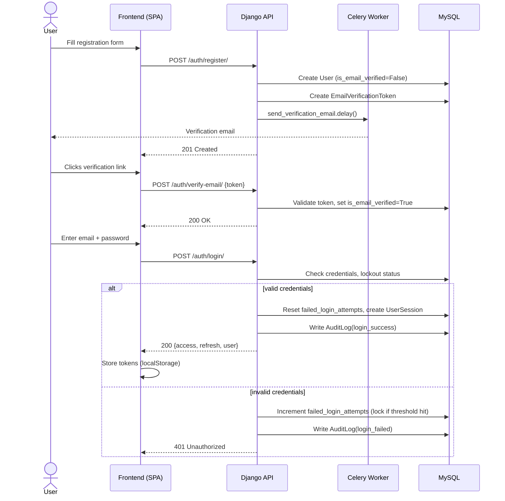
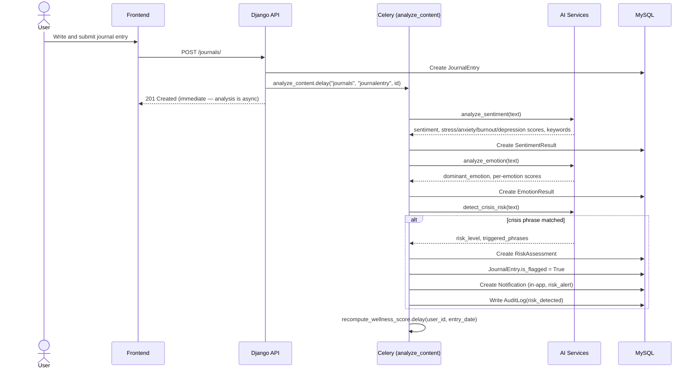
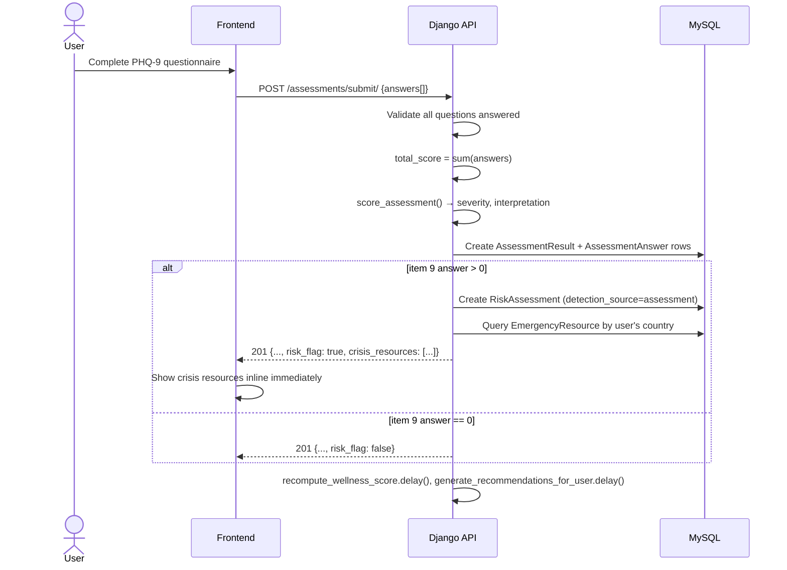
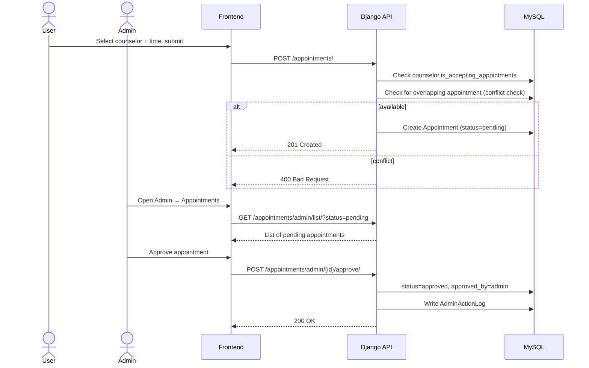

# Sequence Diagrams

## 1. Registration, email verification, and login

## 2. Journal entry → AI analysis → risk detection → notification

## 3. Assessment submission with crisis flag (PHQ-9 item 9)

## 4. Appointment booking and admin approval

## 5. LibreChat SSO and conversation sync

See [librechat-integration.md](librechat-integration.md) for the full SSO
sequence diagram and the conversation-sync flow.
