# MindCare AI — Database Schema (Phase 2)

Target engine: **MySQL 8**. Schema is expressed as Django models (source of
truth — see `backend/apps/*/models.py`); this document is the
human-readable ERD and design rationale that final migrations will
generate from.

## Design decisions

- **Primary keys.** All domain tables use a `UUID` primary key
  (`apps.common.models.UUIDPrimaryKeyModel`) instead of auto-increment
  integers, so record IDs exposed via the API can't be enumerated to infer
  user counts or activity volume — relevant given the sensitivity of the
  data (mental health journals, assessment scores, risk flags).
- **Timestamps.** All tables inherit `created_at` / `updated_at` from
  `TimeStampedModel`.
- **Custom user model.** `users.User` authenticates by **email**, not
  username, and carries a coarse-grained `role` (`user` / `admin` /
  `counselor`) used for RBAC (Phase 3).
- **Polymorphic AI results.** `SentimentResult`, `EmotionResult`, and
  `Notification.related_object` use Django's `ContentType` framework
  (`content_type` + `object_id`) so the same result tables serve multiple
  analyzable content types (`JournalEntry`, `ChatMessage`) without
  `ai_engine` importing `journals`/`chat` directly, and without a wide
  table of nullable FK columns.
- **Soft-append audit trail.** `audit.AuditLog` is intentionally separate
  from `admin_panel.AdminActionLog`: `AuditLog` is the security-team-facing,
  system-wide trail (auth events, permission denials, data exports,
  crisis-detection triggers); `AdminActionLog` is the business-facing
  record of moderation/administrative decisions shown in the Admin
  Dashboard.
- **History over mutation.** Rescheduling an `Appointment` creates a new
  row linked via `rescheduled_from` rather than overwriting
  `scheduled_at`, preserving a full audit trail of changes.

---

## Entity-Relationship Diagram

```mermaid
erDiagram
    USERS ||--o| PROFILES : has
    USERS ||--o| COUNSELOR_PROFILES : "has (if role=counselor)"
    USERS ||--o{ USER_SESSIONS : has
    USERS ||--o{ EMAIL_VERIFICATION_TOKENS : has
    USERS ||--o{ PASSWORD_RESET_TOKENS : has

    USERS ||--o{ MOOD_ENTRIES : logs
    USERS ||--o{ JOURNAL_ENTRIES : writes
    JOURNAL_ENTRIES }o--o{ JOURNAL_TAGS : tagged_with
    JOURNAL_ENTRIES ||--o{ JOURNAL_REPORTS : "flagged by"
    USERS ||--o{ JOURNAL_REPORTS : files

    USERS ||--o{ SLEEP_ENTRIES : logs
    USERS ||--o{ MEDITATION_SESSIONS : completes
    RESOURCES ||--o{ MEDITATION_SESSIONS : "used in"

    ASSESSMENT_TYPES ||--o{ ASSESSMENT_QUESTIONS : contains
    USERS ||--o{ ASSESSMENT_RESULTS : takes
    ASSESSMENT_TYPES ||--o{ ASSESSMENT_RESULTS : "scored against"
    ASSESSMENT_RESULTS ||--o{ ASSESSMENT_ANSWERS : contains
    ASSESSMENT_QUESTIONS ||--o{ ASSESSMENT_ANSWERS : answered_by

    JOURNAL_ENTRIES ||..o{ SENTIMENT_RESULTS : "analyzed (polymorphic)"
    CHAT_MESSAGES ||..o{ SENTIMENT_RESULTS : "analyzed (polymorphic)"
    JOURNAL_ENTRIES ||..o{ EMOTION_RESULTS : "analyzed (polymorphic)"
    CHAT_MESSAGES ||..o{ EMOTION_RESULTS : "analyzed (polymorphic)"
    USERS ||--o{ RISK_ASSESSMENTS : "flagged for"
    USERS ||--o{ WELLNESS_SCORE_SNAPSHOTS : has
    USERS ||--o{ MOOD_PREDICTIONS : has

    RECOMMENDATION_TEMPLATES ||--o{ RECOMMENDATIONS : generates
    USERS ||--o{ RECOMMENDATIONS : receives

    USERS ||--o{ CHAT_SESSIONS : starts
    CHAT_SESSIONS ||--o{ CHAT_MESSAGES : contains

    USERS ||--o{ APPOINTMENTS : books
    COUNSELOR_PROFILES ||--o{ APPOINTMENTS : "assigned to"

    USERS ||--o{ NOTIFICATIONS : receives
    USERS ||--o| NOTIFICATION_PREFERENCES : configures

    RESOURCE_CATEGORIES ||--o{ RESOURCES : groups

    USERS ||--o{ ADMIN_ACTION_LOGS : performs
    USERS ||--o{ GENERATED_REPORTS : requests
    USERS ||--o{ AUDIT_LOGS : triggers

    USERS {
        UUID id PK
        string email UK
        string first_name
        string last_name
        string role "user|admin|counselor"
        bool is_active
        bool is_email_verified
        datetime date_joined
    }

    PROFILES {
        UUID id PK
        UUID user_id FK
        string profile_picture
        date date_of_birth
        string country_code
        string theme_preference
    }

    MOOD_ENTRIES {
        UUID id PK
        UUID user_id FK
        string mood
        int intensity "1-10"
        date entry_date
        time entry_time
        text notes
    }

    JOURNAL_ENTRIES {
        UUID id PK
        UUID user_id FK
        string title
        text body
        string mood
        date entry_date
        string visibility "private|public"
        bool is_flagged
    }

    ASSESSMENT_RESULTS {
        UUID id PK
        UUID user_id FK
        UUID assessment_type_id FK
        int total_score
        string severity
        text interpretation
        datetime taken_at
    }

    SENTIMENT_RESULTS {
        UUID id PK
        int content_type_id FK
        UUID object_id
        string sentiment
        float confidence_score
        float stress_score
        float anxiety_score
        float burnout_score
        float depression_indicator_score
        json keywords
    }

    EMOTION_RESULTS {
        UUID id PK
        int content_type_id FK
        UUID object_id
        string dominant_emotion
        json scores
    }

    RISK_ASSESSMENTS {
        UUID id PK
        UUID user_id FK
        string risk_level "none|low|moderate|high|critical"
        string detection_source
        json triggered_phrases
        datetime resources_shown_at
    }

    WELLNESS_SCORE_SNAPSHOTS {
        UUID id PK
        UUID user_id FK
        date score_date
        int overall_score "0-100"
        float mood_component
        float journal_component
        float assessment_component
        float sleep_component
        float activity_component
        float chat_sentiment_component
    }

    RECOMMENDATIONS {
        UUID id PK
        UUID user_id FK
        UUID template_id FK
        string category
        string source
        string status
    }

    CHAT_SESSIONS {
        UUID id PK
        UUID user_id FK
        string title
        bool is_archived
    }

    CHAT_MESSAGES {
        UUID id PK
        UUID session_id FK
        string sender "user|assistant"
        text content
    }

    APPOINTMENTS {
        UUID id PK
        UUID user_id FK
        UUID counselor_id FK
        datetime scheduled_at
        int duration_minutes
        string status
        UUID rescheduled_from_id FK
    }

    NOTIFICATIONS {
        UUID id PK
        UUID user_id FK
        string notification_type
        string channel
        bool is_read
    }

    RESOURCES {
        UUID id PK
        UUID category_id FK
        string title
        string resource_type
        bool is_published
    }

    ADMIN_ACTION_LOGS {
        UUID id PK
        UUID admin_user_id FK
        string action
        string target_model
        string target_id
    }

    AUDIT_LOGS {
        UUID id PK
        UUID user_id FK
        string action
        string ip_address
        json metadata
        datetime created_at
    }
```

---

## Table Reference

| Table | App | Purpose |
|---|---|---|
| `users` | users | Auth identity (email/password/role), extends `AbstractBaseUser` |
| `profiles` | users | Personal/display info, 1:1 with `users` |
| `counselor_profiles` | users | Counselor-specific fields, 1:1 with `users` (role=counselor) |
| `user_sessions` | users | Issued refresh-token sessions (remember me, session expiry, revocation) |
| `email_verification_tokens` | users | One-time email verification tokens |
| `password_reset_tokens` | users | One-time password reset tokens |
| `mood_entries` | moods | Daily mood check-ins |
| `journal_tags` | journals | Reusable tags for journal entries |
| `journal_entries` | journals | User journal entries |
| `journal_reports` | journals | Moderation flags on journal entries (manual or AI-triggered) |
| `sleep_entries` | wellness | Manual sleep log (dashboard's sleep placeholder + wellness score input) |
| `meditation_sessions` | wellness | Completed meditation/breathing sessions |
| `assessment_types` | assessments | PHQ-9 / GAD-7 / Stress / Burnout / Self-esteem definitions |
| `assessment_questions` | assessments | Per-instrument question bank |
| `assessment_results` | assessments | A user's completed assessment + score/severity |
| `assessment_answers` | assessments | Per-question answers for a result |
| `sentiment_results` | ai_engine | Sentiment/stress/anxiety/burnout/depression scores (polymorphic) |
| `emotion_results` | ai_engine | Emotion classification scores (polymorphic) |
| `risk_assessments` | ai_engine | Crisis-language detection outcomes |
| `wellness_score_snapshots` | ai_engine | Daily computed Wellness Score (0-100) + components |
| `mood_predictions` | ai_engine | Forward-looking mood forecast |
| `recommendation_templates` | recommendations | Admin-managed recommendation catalogue |
| `recommendations` | recommendations | Recommendation instances generated for a user |
| `chat_sessions` | chat | AI companion conversation |
| `chat_messages` | chat | Messages within a chat session (user + AI companion turns) |
| `appointments` | appointments | Counseling session bookings |
| `notification_preferences` | notifications | Per-user reminder opt-ins + channel prefs |
| `notifications` | notifications | In-app/email notification instances |
| `resource_categories` | resources | Resource groupings |
| `resources` | resources | Articles, videos, podcasts, meditations, breathing exercises |
| `emergency_resources` | resources | Crisis hotlines by country |
| `admin_action_logs` | admin_panel | Admin/moderation action history |
| `generated_reports` | admin_panel | Generated PDF/CSV report exports |
| `audit_logs` | audit | Security audit trail (auth, access, crisis triggers) |

Full column-level detail (types, constraints, indexes) is in each app's
`models.py` — see `backend/apps/<app>/models.py`, which is the executable
source of truth this document mirrors.

---

## Normalization notes

Schema targets **3NF**: no repeating groups, all non-key attributes depend
on the whole primary key, and derived/computed values (e.g.
`WellnessScoreSnapshot` components) are stored as **snapshots** rather than
normalized away, because they represent a point-in-time computed fact
(what the score was on that date), not a value that should stay in sync
with its inputs after the fact — recomputing history on every mood-entry
edit would be both expensive and would falsify the historical record.

`AssessmentQuestion.options` and `Resource.tags` are the two intentional
`JSON` (denormalized) fields: answer-scale options are fixed per
instrument and never queried/filtered on individually, and tags are
freeform and low-cardinality enough that a join table would add cost
without a query benefit at this scale.

---

## Migration plan (Phase 3)

1. `python manage.py makemigrations` per app once `config/settings` and
   `INSTALLED_APPS` are wired up.
2. Seed data migrations: `AssessmentType` + `AssessmentQuestion` (real
   PHQ-9/GAD-7/etc. item text and severity cut-offs), `RecommendationTemplate`
   starter catalogue, `EmergencyResource` starter set per supported country.
3. `python manage.py migrate` against MySQL 8 (via Docker Compose `db` service).
